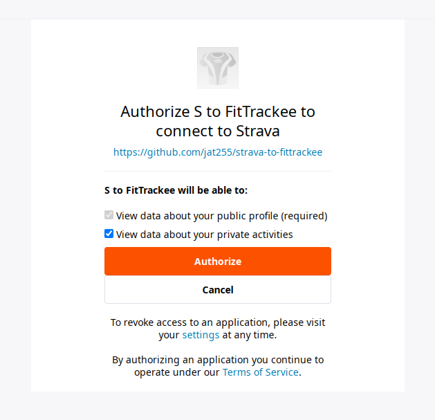
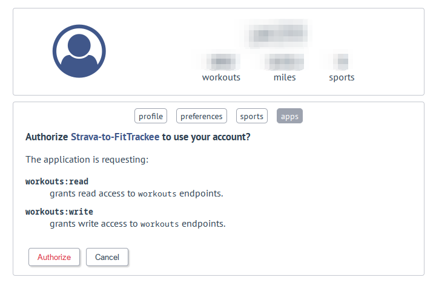

# Strava-to-FitTrackee

This is a little tool that will pull workouts from a [Strava](https://www.strava.com/)
account and push them to a [FitTrackee](https://github.com/SamR1/FitTrackee/) instance.
The tool was written to help automatically backup workout tracks from the commercial
service onto a self-hosted instance for safe keeping.

## Prerequisites

You'll need the following:

  - An installation of [FitTrackee](https://github.com/SamR1/FitTrackee/)
  - An OAuth2 application configured for FitTrackee (go to the "Apps" section
    of your FitTrackee account to configure this)
      - The app needs access to the `workouts:read` and `workouts:write` scopes
      - You'll need to use the "Id" and "Secret" (only showed at creation time)
        to configure this script, so make sure to write them down
      - When you create your app, the Application URL and Redirect URL can be pretty
        much anything, but must start with `https://`. I used `https://localhost/`
  - A Strava account with an "API Application" created and enabled (see 
    [API Settings](https://www.strava.com/settings/api))
      - The name, category, website, etc. can all be whatever you want since this
        is for private use. You can't use the term "Strava" in your application name
        though, I guess so users don't think your app is an official Strava app
      - You'll need to use your "Client ID" and "Client Secret" from this page
  - [Poetry](https://python-poetry.org/) installed on the system where this
    tool will run
  - A Python installation version 3.9 or higher. Installing this will depend
    on your specific system, but I highly recommend using 
    [`pyenv`](https://github.com/pyenv/pyenv), which will allow you to install
    any version of Python you'd like and choose between them as needed. Assuming
    you have at least one 3.9 or higher version installed with `pyenv`, Poetry is
    smart enough to pick up that and use the correct Python version when installing
    `strava-to-fittrackee`.
      - If you prefer to use system packages, on recent versions of Ubuntu you should
        be able to run `sudo apt install python3.9`. If using the system package, you'll
        probably also need to run `poetry env use 3.9` to configure poetry to use that
        specific version. 
      - If using `pyenv`, running `$ pyenv install 3.9.16` or `$ pyenv install 3.10.10`
        should get you a version that will work with `s2f.py`. In this case, Poetry should
        be clever enough to analyze the versions of Python you have installed and pick the
        correct one (although you can also run that `poetry env use` command to specify a
        particular one)

## Installation

Download or clone the code from this repository:

```sh
$ git clone https://github.com/jat255/strava-to-fittrackee.git
```

Copy the `.env.example` file to a file named `.env` and configure the values as 
documented in order to set the appropriate API client IDs and secrets, as well as
the FitTrackee host (currently, https verification is not enabled because FitTrackee
is often hosted with a self-signed certificate).

Install the script's dependencies by running:

```sh
$ poetry install --no-root
```

This will create new virtual environment and install the dependencies for the script.

## Usage

*Note: For any of the examples below, if you add the `-v 2` option, you'll get additional
debugging output from the script.*

The first thing to do is check you can call the script using the virtual environment created
by Poetry. Run the following from the directory you downloaded the files to in order
see the "help" output of the script, which will show what it can do:

```sh
$ poetry run python s2f.py -h
```
```
usage: s2f.py [-h] [-v {0,1,2}] (--setup-tokens | --sync | --download-all-strava | --upload-all-fittrackee | --delete-all-fittrackee | --upload-gpx GPX_FILE)
              [--output-folder OUTPUT_FOLDER] [--input-folder INPUT_FOLDER]

This tool provides functionality to download activities from
a Strava "athlete" and upload them as workouts to a FitTrackee
instance (see README.md for more details)

Examples (in your terminal):
    $ python s2f.py --sync
    $ python s2f.py --download-all-strava --output-folder <folder_name>
    $ python s2f.py --upload-all-fittrackee --input-folder <folder_name>
    $ python s2g.py --delete-all-fittrackee

Copyright (c) 2022, Joshua Taillon

optional arguments:
  -h, --help            show this help message and exit
  -v {0,1,2}, --verbosity {0,1,2}
                        increase output verbosity (default: 1)
  --setup-tokens        Setup initial token authentication for both Strava and FitTrackee. This will be done automatically if they are not already set up, but this
                        option allows you to do that without performing any other actions
  --sync                Download activities from Strava not currently present in FitTrackee and upload them to the FitTrackee instance
  --download-all-strava
                        Download and store all Strava activities as GPX files in the given folder (default: "./gpx/", but can be changed with "--output-folder" option)
  --upload-all-fittrackee
                        Upload all GPX files in the given folder as workouts to the configured FitTrackee instance. (default folder is "./gpx/", but can be configured
                        with the "--input-folder" option)
  --delete-all-fittrackee
                        Delete all workouts in the configured FitTrackee instance
  --upload-gpx GPX_FILE
                        Can be used to upload a single GPX file to the FitTrackee instance
  --output-folder OUTPUT_FOLDER
                        Folder in which to store GPX files generated from Strava activities (if the "--download-all-strava" option is given; default: "./gpx")
  --input-folder INPUT_FOLDER
                        Folder in which to find GPX files to be uploaded to FitTrackee (if the "--upload-all-fittrackee" option is given; default: "./gpx")
```

### Setup authentication

To get started with the script, you'll need to authorize your "API apps" (created earlier)
for both Strava and FitTrackee. To do this, run the script with the `--setup-tokens` option:

```sh
$ poetry run python s2f.py --setup-tokens
```

This will first present you (in the terminal) with a link to Strava, which (after logging in) 
will prompt you to authorize the application:



When you click "Authorize", your browser will be redirected to a URL starting with 
`http://localhost` that doesn't work. That's okay. Copy the entire URL from your browser's
address bar and paste it into the terminal, then press the enter key on your keyboard. 
The URL you pasted contains a `code` parameter that is used to generate authentication
tokens for the app, which it will then use to access the API on your behalf. These tokens
will be saved into a file named `.strava.tokens.json` (unless you changed the location with
the `STRAVA_TOKEN_FILE` setting). As long as that file is present, the script will be able
to use the access and refresh tokens it contains to access your data via the API.
(If you're curious, [this link](https://developer.okta.com/blog/2017/06/21/what-the-heck-is-oauth)
describes the "OAuth" process and what the tokens are for).

Once you've pasted in the Strava code, the script will then perform the same process
for FitTrackee. You'll be presented with a link to your FitTrackee instance (which is built
from the `FITTRACKEE_HOST` setting in the `.env` file), and upon visiting it, you'll see the
authorization screen:



Click "Authorize" and again you'll be redirected to a URL that does not exist. Copy the URL
from your browser's address bar and paste into the terminal once again, and press "enter".
Assuming everything worked as designed, you'll now have two `.json` files in your current
directory containing tokens for both Strava and FitTrackee. 

If you run the `--setup-tokens` option again, you'll notice that you don't get presented
with the authorization URLs again. This is because the script will read the token files
saved previously and check that they're valid (and refresh them, if not). You'll only
need to go through the URL authorization again if you delete or rename the token files.

### Basic sync usage

Once your tokens are set up, run the script with the `--sync` option:

```
$ poetry run python s2f.py --sync
```

This will check your FitTrackee account for the last workout, and then fetch
all activities from Strava after that time, generating a GPX file for each one
then uploading it to FitTrackee. A link to the original Strava activity will
be included as a "note" that is displayed in FitTrackee. Currently, segments
*will not* be copied from the Strava API, although it's possible that could be
improved in the future. Sport types will be mapped as best as possible (see
the `sport_id_map` value in the `FitTrackee.upload_gpx()` method for specifics),
but FitTrackee doesn't have a corresponding sport type for every activity type
in Strava, so it will probably give an error if there's one it doesn't recognize.

If you run this command without any workouts in FitTrackee, it will attempt to 
sync all activities, which will take quite a while if you have many activities. 
Depending on the number of activities present, this will likely cause the code 
to go over the Strava API rate limits (currently 100 requests per 15 minutes 
and 1000 requests per day), since each activity requires 4 requests to get the 
location data required to build a GPX file. So, if you have more than about 
200-250 activities or so, this process will take multiple days -- blame Strava's 
rate limits!

To workaround this, the script will automatically back-off while running and 
sleep until the next 15 minute interval. There is no functionality to deal 
with the 1000 request limit, so if that gets hit, it will just continue trying 
every fifteen minutes (although it should start working on the next day if you 
let it continue running). Alternatively, you can kill the program and restart 
it the next day manually, and already-downloaded activities will be skipped.
If you'd like to see what the current API limits are at each point in the code,
run with `DEBUG` level verbosity (`-v 2`) to print more information about the
API responses.

If you hit the rate limit (with `-v 2` enabled), you'll see output like follows:

```
DEBUG:s2f:Getting latitude and longitude for activity 123456789
DEBUG:s2f:Current API usage -- 15 minute: 101/100 -- daily: 732/1000
WARNING:s2f:Hit Strava API limit; sleeping until next 15 minute interval
WARNING:s2f:Time is now 2022-11-04T22:17:12.725154; Sleeping until at least 2022-11-04T22:30:00
```

During regular day-to-day use, this shouldn't be an issue, but it can cause some
annoyance/delays during the initial sync. The script can be run with `--sync` at any
time, and it will be much faster on subsequent runs since it will only look for new
activities.

### Scheduling a daily (or other interval) sync

The script can be scheduled using a tool such as `cron`, or the Windows task scheduler
to run at one ore more set times each day. A line such as the following will run
the script twice per hour every day, logging to a file named `s2f.log`
in the home directory of `user`. This example assumes you installed Poetry to its
default location (run `$ which poetry` to find the correct executable location if
yours is different):

```
5,35 * * * *  cd /home/user/s2f && /home/user/.local/bin/poetry run python s2f.py --sync -v 2 >> /home/user/s2f.log 2>&1
```

By changing to the `s2f` directory and running the script via `$ poetry run python s2f.py`,
Poetry should automatically determine the correct Python interpreter to use.

### Bulk downloading from Strava

Although the `--sync` option should work with large numbers of activities (subject to the rate
limitations described above), if you'd ever like to bulk export activities from Strava
and save the resulting GPX files to disk, use the `--download-all-strava` option:

```sh
$ poetry run python s2f.py --download-all-strava
```

By default, this will download all your activities into a subfolder named `./gpx`,
but this location can be changed with the `--output-folder` option, *e.g.*:

```sh
$ poetry run python s2f.py --download-all-strava --output-folder /home/user/Downloads/
```

You will likely run up against the Strava API limits with this method as well, and so
it will automatically wait for 15 minute intervals like `--sync`. The resulting GPX
files will have the "activity type" (Hike, Walk, etc.) saved in the `description` field,
and a link to the original Strava activity will be included as well. 

### Bulk uploading to FitTrackee

A corollary to the bulk download option, you can run the script with the 
`--upload-all-fittrackee` option to upload a folder of GPX tracks to FitTrackee.
The default folder is `./gpx` (so it will work without changing any options after
running a download), but you can change the folder to read from with the 
`--input-folder` option.

This option may not work as-is with arbitrary GPX files produced by other means.
The uploader code expects certain content in the GPX file that is written when
downloading from Strava, so it may or may not work. 

### Upload single GPX to FitTrackee

This is mostly a vestige of testing, but there's also an option (`--upload-gpx`)
that will upload a single GPX file to the FitTrackee instance. Provide the path of the
file after the `--upload-gpx` option as follows:

```sh
$ poetry run python s2f.py --upload-gpx ./gpx/test_file.gpx
```

### Delete all FitTrackee workouts

This is again mostly a leftover from testing, but the `--delete-all-fittrackee` will use
the API to delete *all* workouts from the instance. The script will ask you to confirm that
this is really what you want to do before actually doing it:

```sh
$ poetry run python s2f.py --delete-all-fittrackee -v 2
```
```
DEBUG:s2f:Initializing FitTrackeeConnector
DEBUG:s2f:Setting up FitTrackee auth
DEBUG:s2f:Using existing FitTrackee tokens with self-refreshing client
DEBUG:s2f:Getting all workouts from FitTrackee (in pages of 30)
DEBUG:s2f:Fetched page 1 of workouts (fetched 30 so far)
DEBUG:s2f:Fetched page 2 of workouts (fetched 60 so far)
DEBUG:s2f:Fetched page 3 of workouts (fetched 90 so far)
DEBUG:s2f:Fetched page 4 of workouts (fetched 120 so far)
DEBUG:s2f:Fetched page 5 of workouts (fetched 123 so far)
This will delete all 123 workouts in the configured FitTrackee instance!
Are you sure you want to do this? [y]es or [n]o:
```

## Troubleshooting / Known Limitations

- "Manual" activities are ignored:
  - If you have manual (i.e. without GPS data) files in your Strava account,
    they will be ignored and not uploaded to FitTrackee (they could be, in theory,
    it just was not a priority at the time of writing)
- Activity types missing:
  - This is moreso a limitation of FitTrackee, but by default, there are not
    sport types for every type of activity that's available on Strava. If you
    try to sync a sport type not supported in FitTrackee, it will probably error
    (I haven't tried, but I think it will fail).
- Emojis are not supported:
  - If you have a Strava activity with emoji (or other non-ASCII characters),
    FitTrackee will choke on that input and will produce an error. To workaround
    this, rename any activities in Strava that have these characters and try again.
- FitTrackee returns `429 Client Error: TOO MANY REQUESTS`:
  - There is a default API limit of 300 requests per 5 minutes for FitTrackee.
    On the initial sync, it's possible that you could push against this. Either wait
    a little while, or change the `API_RATE_LIMITS` environment setting in your FitTrackee
    environment. I used the following: `API_RATE_LIMITS==10000 per 5 minutes`
- `RuntimeError: Exiting because a lock file exists`...
  - If you see this error, it is because of a part of the code that checks for a
    "lock file" that is created when the script first starts. The purpose of this
    is to prevent multiple copies from running at the same time, which can result
    in duplicate workouts (i.e. if two `--sync` operations start near the same time).
    In normal usage, the script will give an error if it detects the `s2f.pid` file
    is present, and that file should be deleted when the first copy of the script exits.
    In some error situations, this file does not get cleaned up properly though, and you
    might have to delete it manually. Simply remove the `s2f.pid` file and the script
    will run again.
